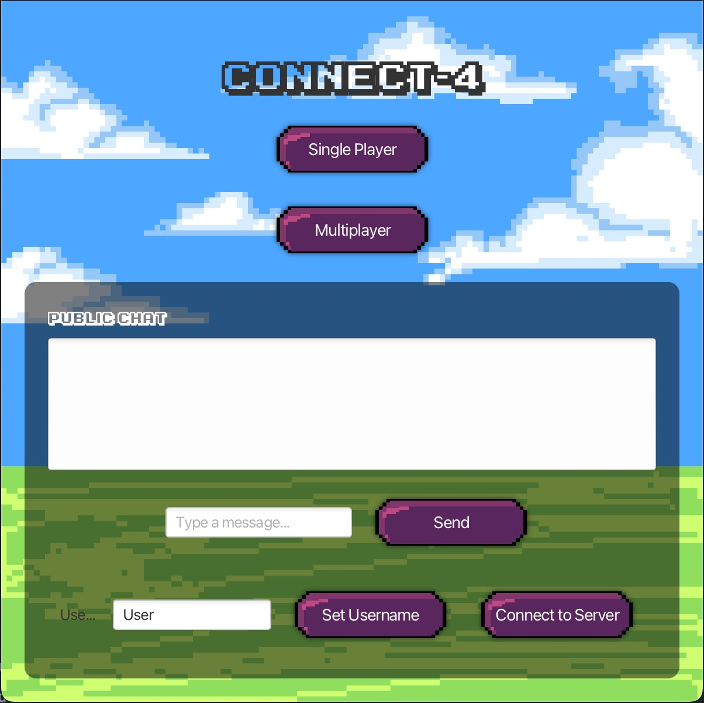
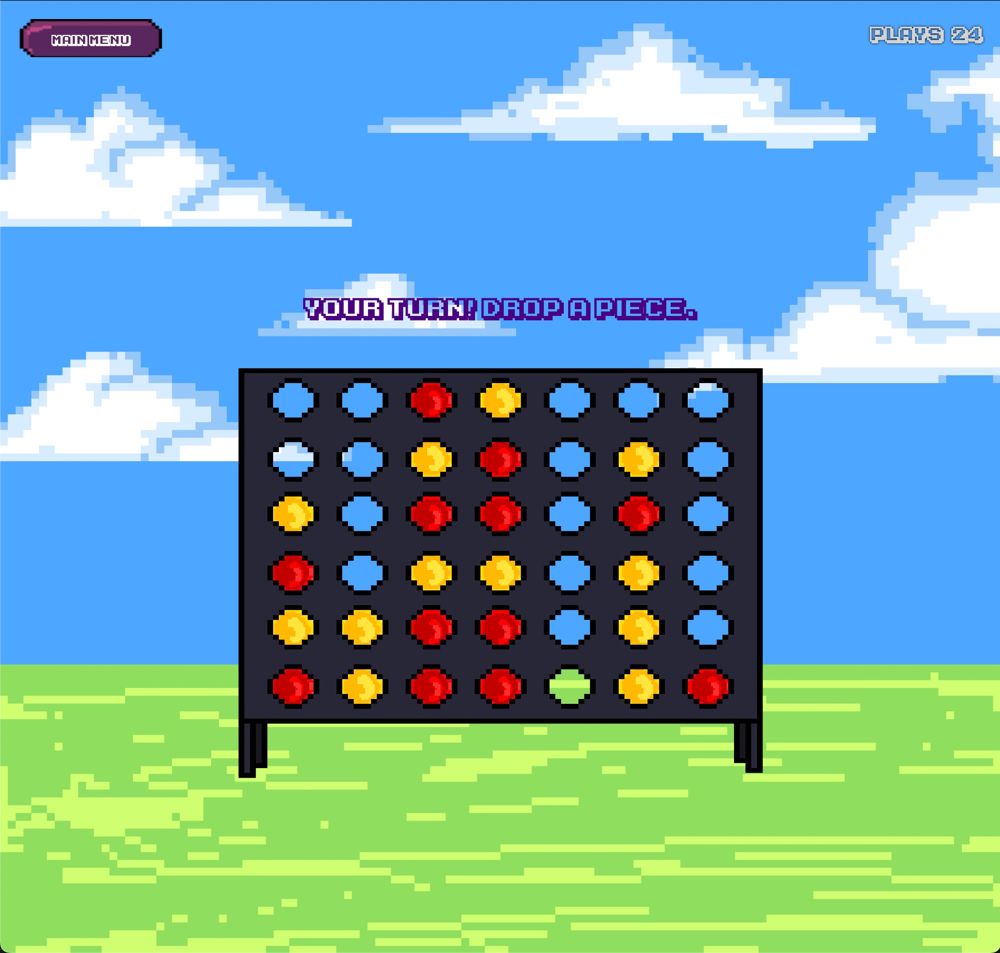

# Connect‑Four Network Game

This repository contains two standalone Java Maven projects that together implement a networked Connect‑Four game with both human and AI opponents, custom pixel‑art graphics, and in‑app chat. This project earned a spot in the top 20 class submissions.

## Folder Structure

```
.
├── Project3Server    # Maven project for the game server (matchmaking, game state, logging)
├── Project3Client    # Maven project for the JavaFX GUI client (game board, chat, AI mode)
└── README.md         # This file
```

## Prerequisites

* Java JDK 8 or later installed and on your PATH
* Apache Maven 3.6 or newer
* (Optional) IDE with Maven support (IntelliJ IDEA, Eclipse, VS Code)

## Building & Running

Each component is built and run independently. From the root directory:

1. **Start the server**

   ```bash
   cd Project3Server
   mvn clean compile exec:java
   ```

   This launches the matchmaking server on the default port.

2. **Launch the client**

   ```bash
   cd Project3Client
   mvn clean compile exec:java
   ```

   The GUI window will open. Enter server address and username to connect.

## Features

* **Human vs. Human & Human vs. Computer**: Choose between online multiplayer or single‑player with a minimax AI opponent.
* **Thread‑Safe Server**: Handles multiple concurrent games, user authentication (no duplicate usernames), and chat routing.
* **Custom Pixel‑Art Graphics**: Retro‑style board, pieces, and animations crafted from scratch in JavaFX.
* **In‑App Chat**: Real‑time messaging between players during a match.

## Screenshots

### Main Game Screen



### Retro-Style Animation



## Contributing

Contributions are welcome! Feel free to fork the repo, make changes, and submit a pull request with clear descriptions.

## License

This repository contains academic coursework for CS 342 @ UIC.
